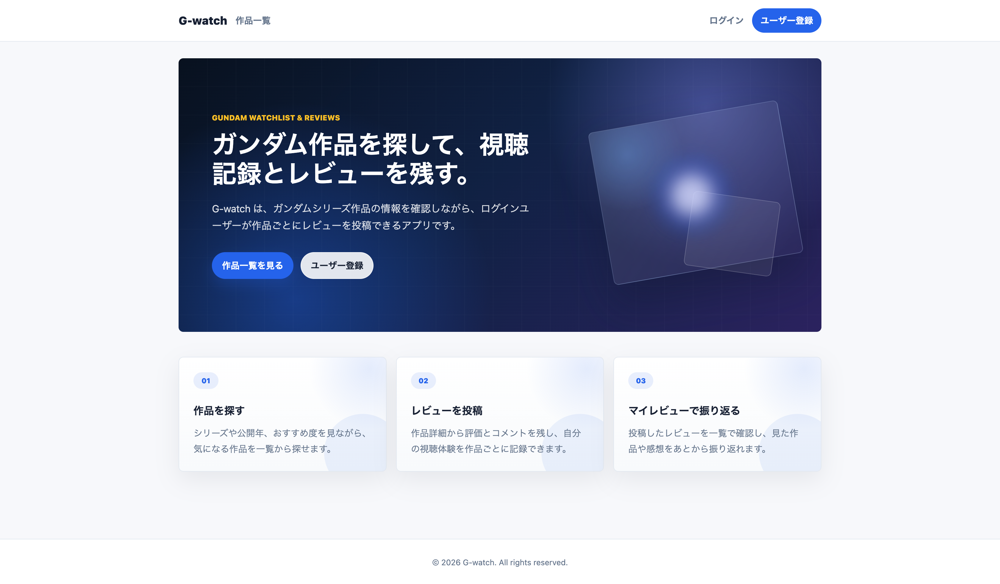
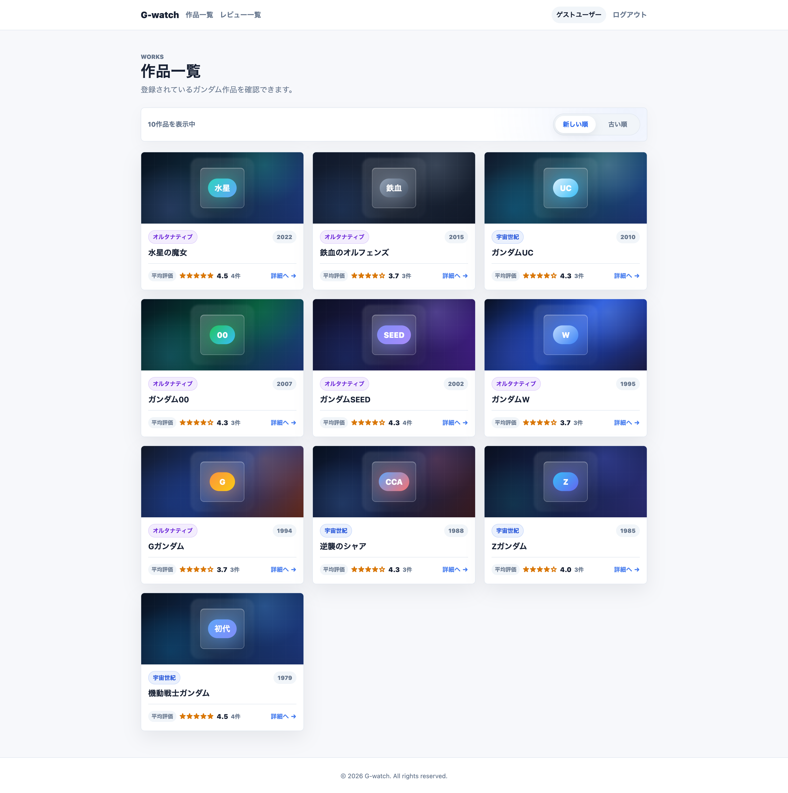
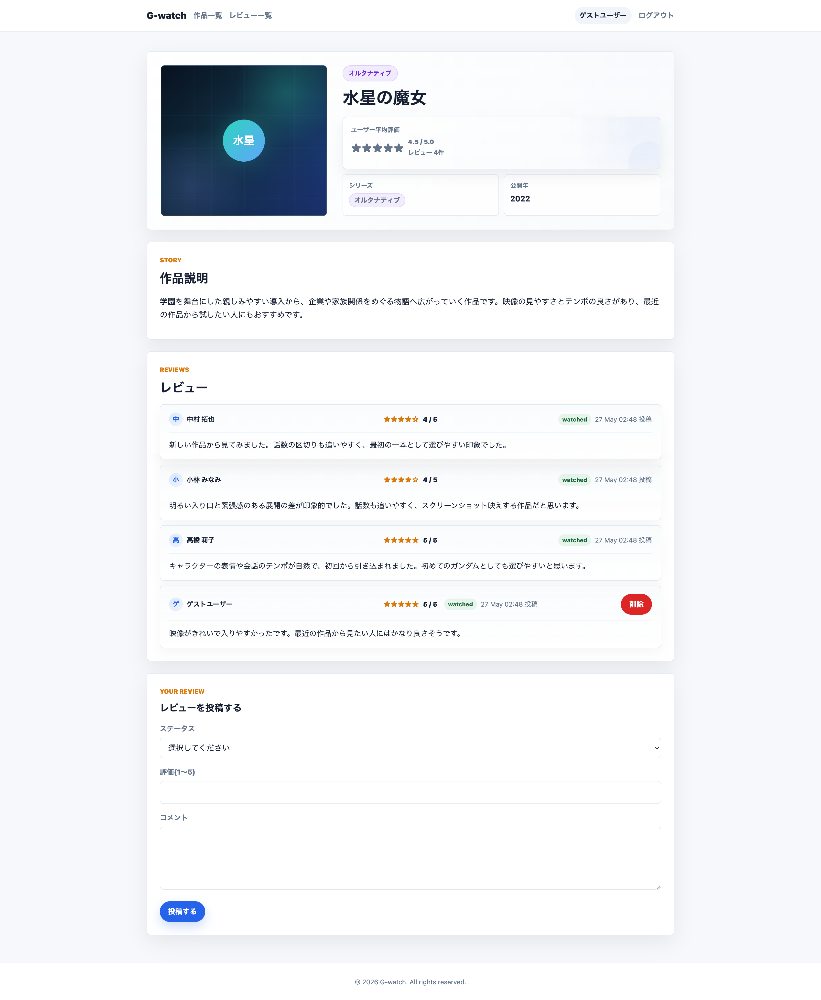
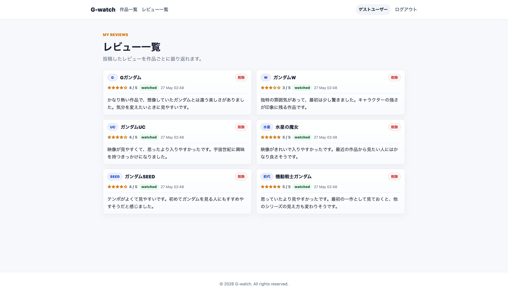
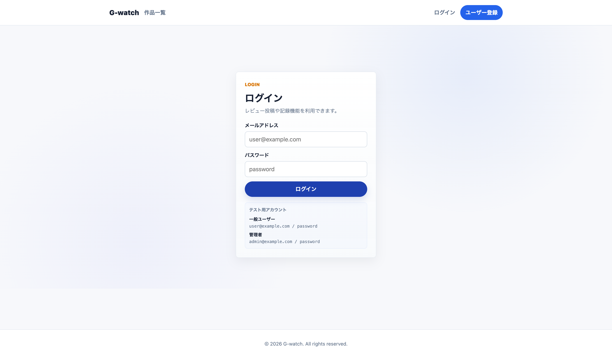
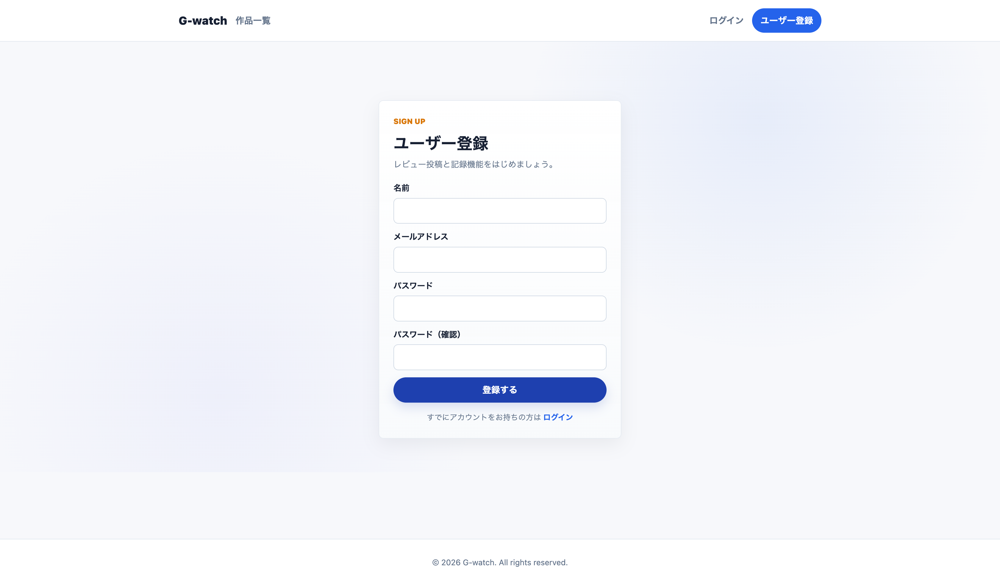
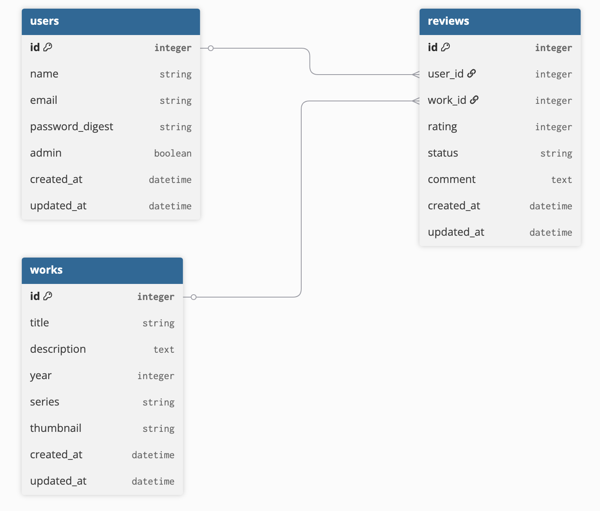

# G-watch

ガンダムシリーズ作品のレビュー共有サービスです。
作品情報の閲覧、レビュー投稿、平均評価の確認、視聴記録の整理を行えます。



---

## サービス概要

G-watch は、ガンダムシリーズ作品の情報閲覧とレビュー投稿ができる Web アプリです。

ガンダムシリーズは作品数が多く、宇宙世紀やオルタナティブ作品など複数の世界線があります。そのため、初見ユーザーにとっては「どこから見るべきか」「各作品がどのように評価されているか」を把握しづらいと感じたことから制作しました。

G-watch では、作品ごとのレビューや平均評価を確認できるようにし、シリーズ選びや視聴後の感想整理をしやすい構成を目指しています。

- Service URL: [https://g-watch.onrender.com](https://g-watch.onrender.com)
- GitHub URL: [https://github.com/Ryusei2742/G-watch](https://github.com/Ryusei2742/G-watch)

---

## 主な機能

- ユーザー登録 / ログイン / ログアウト
- 作品一覧の閲覧
- 作品詳細の閲覧
- 作品ごとのレビュー投稿
- 平均評価とレビュー数の表示
- 自分のレビュー一覧表示
- 自分のレビュー削除
- 管理者による作品の作成 / 編集 / 削除

---

## 使用技術

| Category | Technology |
| --- | --- |
| Backend | Ruby 3.3.3 / Ruby on Rails 6.1.7 |
| Database | PostgreSQL / pg 1.5 |
| Frontend | ERB / SCSS / Webpacker 5.4 |
| Infrastructure | Render |
| Authentication | has_secure_password / session |
| Test | RSpec 3.13 / FactoryBot |

---

## セットアップ

```bash
git clone https://github.com/Ryusei2742/G-watch.git
cd G-watch

bundle install
yarn install

rails db:create
rails db:migrate
rails db:seed

bin/dev
```

---

## テスト

```bash
bundle exec rspec
```

---

## 画面一覧

### トップページ


### 作品一覧



### 作品詳細



### マイレビュー



### ログイン



### ユーザー登録



---

## ER図



---

## 工夫した点

- レビュー投稿時に `user_id` をフォームから受け取らず、`current_user` に紐づけて作成する設計にしました。
- 作品一覧の並び替えは `WorksController#index` 側で行い、view は表示責務に寄せました。
- 作品詳細ではレビューの平均評価とレビュー件数を表示し、レビューアプリとして必要な情報を優先して見せています。
- 管理者のみ作品の作成 / 編集 / 削除を行えるようにし、一般ユーザーのレビュー投稿機能と役割を分離しました。
- 作品一覧、作品詳細、マイレビュー、認証画面のUIをSCSSで整え、画像がない作品でも略称バッジと抽象プレースホルダーで見やすくしました。
- カードUIやバッジUIは画面ごとにclass命名を整理し、一覧・詳細・レビュー画面でデザインの統一感を持たせました。
- RSpec の request spec / model spec を導入し、作品管理やレビュー投稿まわりの主要動作を確認できるようにしました。

---

## 今後の改善

- 作品検索・絞り込み機能
- ページネーション機能
- レビュー編集機能
- お気に入り機能
- レスポンシブUIのさらなる最適化
- テスト範囲の拡充
